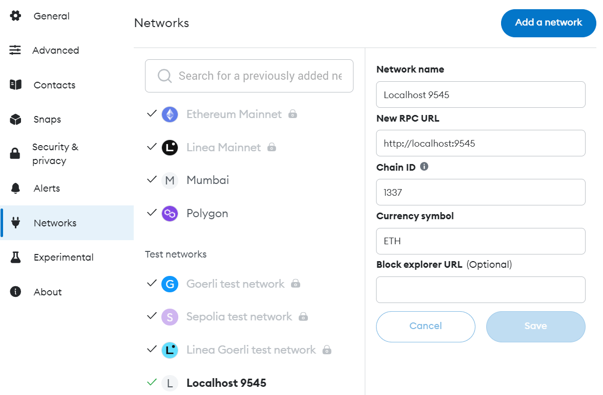

# PaybackOnBlockchain

## Summary

This project is part of a bachelor thesis for the ***University of Technology, Arts, Sciences in Cologne, Germany***.

Total supply of the PBT (PayBackToken) is 1 000 000 (1M) with no decimals.
1 Token is worth 1 Cent,
10 Tokens = 10 Cent
100 Tokens = 1 Euro

## How to test the system on local network

### Set up

1. Install [Node.js](https://nodejs.org/en/download/current "https://nodejs.org/en/download/current") on your computer.
2. Install Truffle by running `npm install -g truffle` in a terminal.
3. Install the [Metamask wallet extension](https://chrome.google.com/webstore/detail/metamask/nkbihfbeogaeaoehlefnkodbefgpgknn "https://chrome.google.com/webstore/detail/metamask/nkbihfbeogaeaoehlefnkodbefgpgknn") on your browser and create an account.
4. Download this repository.

### Run code

#### Deploy the smart contracts

1. Open the project in VS Code or other editor.
2. Navigate to the truffle project folder in the terminal `cd payback-token-truffle`
3. Run this command to install all truffle dependecies `npm install`
4. Run  `truffle develop`
5. Copy the private key of the last Account with id (9) from the terminal and import this account into your metamask wallet in the browser. [MetaMask Support: How to import an account](https://support.metamask.io/hc/en-us/articles/360015489331-How-to-import-an-account#h_01G01W07NV7Q94M7P1EBD5BYM4 "https://support.metamask.io/hc/en-us/articles/360015489331-How-to-import-an-account#h_01G01W07NV7Q94M7P1EBD5BYM4")
6. Change the network in your Metamask Wallet to Localhost 9545

7. Run this command to deploy the smart contracts in a local blockchain ``migrate --network development --reset``

#### **Start the frontend**

1. Copy the *contract address* from the terminal output of the previous step.
2. Open the next.config.js file in the /frontend folder and update the CONTRACT_ADDRESS variable with the copied value.
3. Open a new termial.
4. Navigate to the frontend folder in the terminal `cd frontend`
5. Run this command to install all frontend dependecies `npm install`
6. Run this command to start the frontend `npm run dev`

## Use Cases

### Kaufland becomes a partner

1. Kaufland Germany and Payback have agreed to be partners.
2. Payback employee goes to the internal Payback Website and registers Kaufland as a partner with the following data:
   name: "Kaufland DE"
   adress: {public key of the kaufland wallet}
   currency: "EUR"
   value for token: 2
3. Payback sends the agreed amount of tokens to its new partner Kaufland (ex. 1k PBT)

### Clients register for a payback account

1. Client enters his public key and Payback registers the client.

### Client wants to make purchase from Kaufland and gather PBT using his PayBack Accoount/Wallet

1. User has already selected items to his shopping cart and is on the page, where he has to pay for ex. 50 EUR.
2. User clicks on the button to connect his Metamask wallet in order to gather Points. Wallet is connected.
3. User clicks on the button to calculate the tokens that he can earn.
4. System checks if the user has a PB account.
5. System calculates the amount of Tokens the user should get for 50 EURO
6. Client completes the purchase and Kaufland transfers the amount of tokens (25PBT) from its wallet to the contract wallet, where they are locked for the next 2  weeks.
7. After 2 weeks if the user hasn't decided to return the tokens Payback releases the tokens.
8. User checks his balance of tokens.

### Redeem the tokens . Client wants to use his PBTs from Kaufland in order to get something from another partner DM

1. DM offers a free shampoo in exchange for 300 PBT.
2. Client selects the item and goes to the shopping cart.
3. User clicks on the button to connect his Metamask wallet in order to gather Points. Wallet is connected.
4. User clicks on the button to calculate the tokens that he can earn. and he can spend.
5. System checks if the user has a PB account.
6. System checks if the user has the amount of tokens to pay for the item.
7. Client completes the purchase and Payback opens a MetaMask-Popup for the user to sign the transaction of 300PBT from his account to DM's account.
8. Client approves the transaction (he should have some ETH to be able to sign this transaktion)
9. 300 PBT are transferred to DM's account and the purchase is completed.
